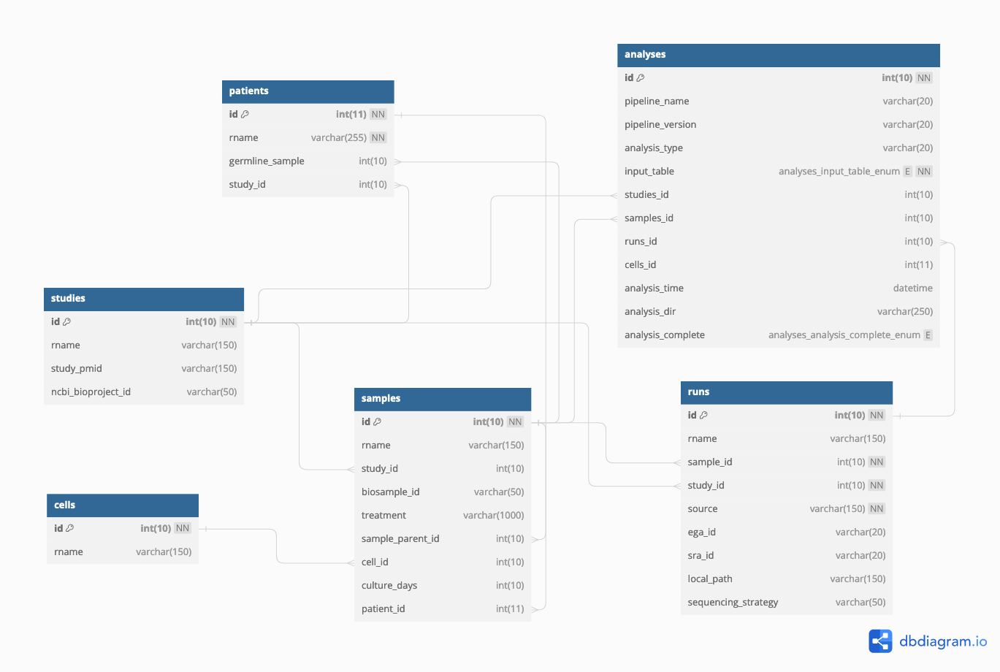

# petljakdb
## Database & API for the Petljak Lab at NYU Langone
Author: [Luka Culibrk](github.com/lculibrk)



This is a description of the Petljak Lab's database, creatively named `petljakdb`. The DB's purpose is to track metadata for sequencing experiments and bioinformatics analyses to ensure consistent, clear, and reproducible access to data and its associated metadata.

This repository includes the above ERD, an example dump of the DB from July 18th, 2024, and a python API used by the lab's bioinformatics pipelines for accessing stored data. 

## The database

Above you will find an [ERD](https://en.wikipedia.org/wiki/Entity%E2%80%93relationship_model) describing the tables in the database. Below is a description of keys that may not be immediately obvious:

| key | description |
|-|-|
| id | numeric identifier for the table, always unique |
| rname | name for the entity, always unique |
| runs.source | describes where the data came from: SRA, EGA, or were we given the raw data? |

## Getting started using the DB

Note that the following must be done on BigPurple/Ultraviolet at NYULH. 

The database can be queried via [mySQL/mariaDB syntax](https://www.javatpoint.com/mariadb-syntax). First you will need a DB account, created by Luka. Once that's set up, the easiest way to authenticate is to create a file `.my.cnf` in your home directory, structured accordingly, replace the text in {} with your own:

```
[client]
user={your_username}
password={your_password}
port=33100
host=db
default-character-set=utf8mb3
```

### Enter the CLI interface:
```
module load mariadb
mysql petljakdb
```

### Some example queries:
Select all the samples from study with ID my_id:

```
SELECT * FROM studies WHERE study_id={my_id};
```

Path to all the raw alignment data for a given study:
```
SELECT id,analysis_dir FROM analyses WHERE study_id={my_id} AND analysis_name="GATK_BAM";
```

Path to all the mutation calls for JSC-1 cells, regardless of study:

```
SELECT * FROM samples INNER JOIN analyses ON analyses.samples_id=samples.id WHERE pipeline_name="MUTECT_CELLLINE" AND cell_id=(SELECT id FROM cells WHERE rname="JSC-1");
```

There are a lot of arcane things you can do with SQL to do increasingly complex queries. See [mySQL/SQL/mariaDB](https://www.javatpoint.com/mariadb-syntax) documentation for more information.

